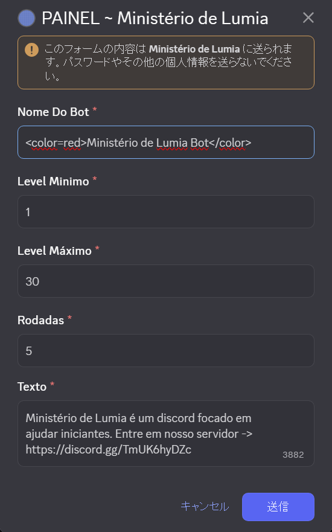
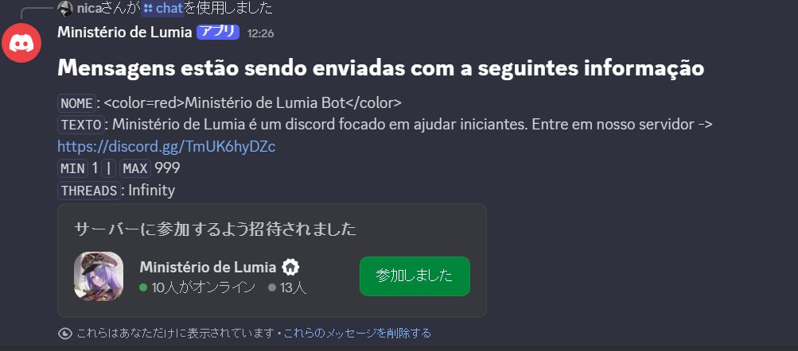
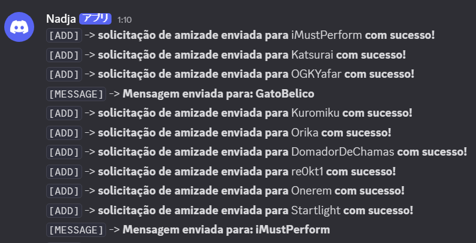

# Ministério de Lumia
- Bot que adiciona todos os jogadores do servidor que joga no SA e envie mensagem divulgado o servidor de novatos<br>

# Model
| Name | Type  | Min  | Max  | Required  | Default|
|------|-------|------|----------|-------|--------|
| `Nome do Bot`| `string` | `3`  | `120`  | `true` | `Ministério de Lumia`

| Min | Type  | Min  | Max  | Required | Default|
|------|-------|------|----------|-------| -----|
| `Level mínimo que vai receber a mensagem`| `uint` | `1`  | `999`  | `true` | `1`

| Max | Type  | Min  | Max  | Required | Default|
|------|-------|------|----------|-------| -----|
| `Level máximo que vai receber a mensagem`| `uint` | `1`  | `999`  | `true` | `30`

| Threads | Type  | Min  | Max  | Required | Default|
|------|-------|------|----------|-------| -----|
| `Quantidade de vezes que o processo vai reiniciar`| `uint` | `1`  | `999`  | `true` | `5`

| Text | Type  | Min  | Max  | Required | Default|
|------|-------|------|----------|-------| -----|
| `Mensagem que será enviada para os usuários `| `string` | `1`  | `4000`  | `true` | `Ministério de Lumia é um discord focado em ajudar iniciantes. Entre em nosso servidor -> https://discord.gg/TmUK6hyDZc`

- Valores padrões são setados caso alguém que não entenda muito bem como funciona o Discord e esqueca de passar alguma informações na hora de alterar o Modal
- O campo `name` aceita coloração. Para adicionar cor no name você precisa passar a tag 
```
<color=<nome-da-cor>Ministério de Lumia</color>
```
- Valores negativos dos campos `min, max e threads` são convertidos para números positivos.
- O campo threads é convertido em **Infinity** caso o número seja **999**
- O campo text pode receber uma variável custom chamada de **{{name}}**. A variável vai trocar o **{{name}}** pelo nome do usuário que vai receber a mensagem.<br>
`L` Exemplo: Olá, {{name}}! entre em nosso servidor caso precis. de ajuda.<br>
`L` Resultado: Olá, nica! entre em nosso servidor caso precise de ajuda.<br>

# Logger
- Mensagens que começa com `[+]` quer dizer que o `Bot` conseguiu enviar as mensagens com sucesso.
- Mensagens que começa com `[-]` quer dizer que o `Bot` não conseguiu enviar as mensagens. Motivo: Sem amigo na `friendlist`.
- Caso o número de `Threads` seja `999 (Infinity)` o `log` com quantos loop restante não será enviado.


# IMAGENS

## DASHBOARD


## MENSAGEM DE QUANDO O PROJETO É INICIADO


## **LOG**
